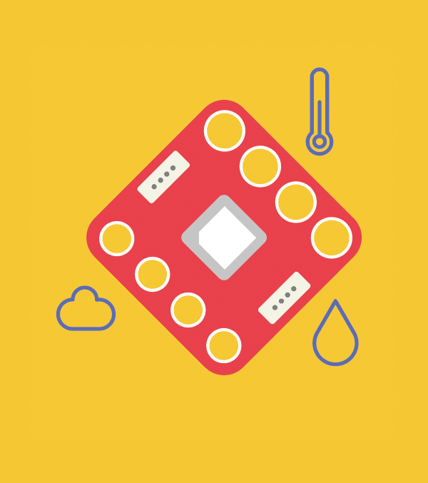

# Calliope mini CO2 Sensor library, based on Sensirion SCD40 Makecode Extension

Makecode extension for the Calliope mini CO2 Sensor (Sensirion SCD40) connected to the Calliope mini platform.

This extension allows you to read CO2, temperature and relative humidity values with an interval of 5 seconds.

## Supported Targets

* PXT/microbit
* Calliope mini

## I2C Address

* 0x62

## Usage

open your Calliope mini makecode project, in "+ Extension", paste the following URL:

https://github.com/calliope-edu/CO2-Sensor-SCD40


## API

Get CO2 value in ppm
```ts
function get_co2()
```

Get temperature in degree celsius. Takes an optional argument to change to fahrenheit.
```ts
function get_temperature()
```

Get relative humidity in percent
```ts
function get_relative_humidity()
```

Start measurement. This method will be automatically called on initialization.
If you call `stop_continuous_measurement()` you have to call this method again before CO2, temperature and humidity
values can be retrieved again.
```ts
function start_continuous_measurement()
```

Stop measurement. After calling this function, no more sensor values can be read out
anymore until you call `start_continuous_measurement`
```ts
function stop_continuous_measurement()
```

## Hardware



## License

[MIT](LICENSE)

Copyright (c) 2021, Sensirion AG